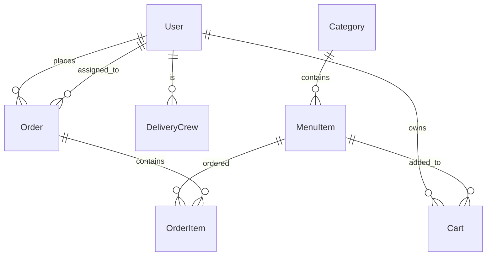

# Little Lemon API

A secure, role-based Django REST Framework project implementing full CRUD operations for a restaurant management system.

## ✨ Features

- **Role-based Authentication**: Manager, Delivery Crew, Customer roles with granular permissions
- **Complete API Coverage**: Menu items, cart management, order processing, user group management
- **Advanced Filtering**: Category, price, featured items with Django Filter
- **Pagination & Sorting**: PageNumberPagination with configurable page size
- **Request Throttling**: Rate limiting for anon (100/day) and authenticated users (1000/day)
- **Comprehensive Error Handling**: Proper HTTP status codes (400/401/403/404)
- **Djoser Integration**: User registration, token auth, password management
- **Production Practices**: Pipenv, custom permissions, detailed validation

## 🏗️ Tech Stack

- **Backend**: Django 5.x, Django REST Framework, Djoser
- **Database**: SQLite (dev) / PostgreSQL (prod)
- **Auth**: TokenAuthentication + Custom Group Permissions
- **Tools**: pipenv, django-filter, django-cors-headers

## 🚀 Quick Start

### Prerequisites
- Python 3.11+
- pipenv
- PostgreSQL (recommended for production)

### Clone & Setup
```bash
git clone https://github.com/yourusername/littlelemon-api.git
cd littlelemon-api
pipenv install
pipenv shell

# Environment variables (.env)
cp .env.example .env
# Edit .env with your SECRET_KEY, DATABASE_URL, etc.

python manage.py migrate
python manage.py createsuperuser
python manage.py runserver
```

## API Documentation

Base URL: `http://localhost:8000/api/`

| Endpoint           | Method | Role     | Description                |
| ------------------ | ------ | -------- | -------------------------- |
| /auth/users/       | POST   | Public   | Register new user          |
| /auth/token/login/ | POST   | Public   | Generate access token      |
| /menu-items/       | GET    | All      | List menu items (filtered) |
| /menu-items/       | POST   | Manager  | Create menu item           |
| /cart/menu-items/  | POST   | Customer | Add to cart                |
| /orders/           | POST   | Customer | Checkout (clears cart)     |

## 🧪 Testing Endpoints

### 1. User Registration
```bash
curl -X POST http://localhost:8000/api/auth/users/ \
  -H "Content-Type: application/json" \
  -d '{
    "username": "testuser",
    "email": "test@example.com",
    "password": "testpass123"
  }'

```
### 2. Login & Get Token
```bash
curl -X POST http://localhost:8000/api/auth/token/login/ \
  -H "Content-Type: application/json" \
  -d '{
    "username": "testuser",
    "password": "testpass123"
  }'

```
### 3. Protected Requests
```bash
curl -X GET http://localhost:8000/api/menu-items/ \
  -H "Authorization: Token YOUR_TOKEN_HERE"
```

## 📋 User Roles & Permissions

### Manager (Full Access)
- ✅ All menu CRUD operations
- ✅ View all orders
- ✅ Assign delivery crew
- ✅ Update order status
- ✅ Manage user groups
- ❌ Add to own cart

### Delivery Crew (Order Management)
- ✅ View assigned orders
- ✅ Update delivery status (0=out, 1=delivered)
- ❌ Menu modifications
- ❌ Cart operations

### Customer (Self-Service)
- ✅ Browse menu (filtered)
- ✅ Cart management
- ✅ Place orders
- ✅ View own orders
- ❌ Manager/Delivery functions

## 🗄️ Database Schema



### Key Models:

- Category: Menu organization
- MenuItem: Dishes with price, featured flag
- Cart: User shopping cart
- Order: Complete orders with status tracking
- OrderItem: Line items linking orders to menu

## 🔧 Project Structure
```
littlelemon-api/
├── LittleLemonAPI/          # Single Django app (per requirements)
│   ├── migrations/
│   ├── models.py           # Core business models
│   ├── serializers.py      # API data validation
│   ├── views.py           # Permission-aware viewsets
│   ├── permissions.py     # Custom role permissions
│   └── urls.py            # API routing
├── littlelemon/            # Django project settings
├── media/                  # User-uploaded images
├── tests/                  # Unit/Integration tests
├── .env                    # Environment variables
├── Pipfile                 # Dependency management
└── README.md
```

## ⚙️ Configuration

### Settings Highlights
```
REST_FRAMEWORK = {
    'DEFAULT_AUTHENTICATION_CLASSES': ['rest_framework.authentication.TokenAuthentication'],
    'DEFAULT_PERMISSION_CLASSES': ['rest_framework.permissions.IsAuthenticated'],
    'DEFAULT_THROTTLE_CLASSES': ['rest_framework.throttling.AnonRateThrottle', 'UserRateThrottle'],
    'DEFAULT_PAGINATION_CLASS': 'rest_framework.pagination.PageNumberPagination',
}
```

### Custom Permissions Example
```
class IsManager(permissions.BasePermission):
    def has_permission(self, request, view):
        return request.user.groups.filter(name='Manager').exists()
```


## 📊 API Response Examples

### Menu Items (GET `/api/menu-items/?category=Pasta`)

```
{
  "count": 25,
  "next": "http://localhost:8000/api/menu-items/?page=2",
  "previous": null,
  "results": [
    {
      "id": 1,
      "title": "Spaghetti Carbonara",
      "price": "18.99",
      "featured": true,
      "category": 2
    }
  ]
}

```
